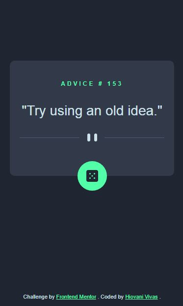

# Frontend Mentor - Advice generator app solution

This is a solution to the [Advice generator app challenge on Frontend Mentor](https://www.frontendmentor.io/challenges/advice-generator-app-QdUG-13db). Frontend Mentor challenges help you improve your coding skills by building realistic projects.

## Table of contents

- [Overview](#overview)
  - [The challenge](#the-challenge)
  - [Screenshot](#screenshot)
  - [Links](#links)
- [My process](#my-process)
  - [Built with](#built-with)
  - [What I learned](#what-i-learned)
  - [Continued development](#continued-development)
  - [Useful resources](#useful-resources)
- [Author](#author)
- [Acknowledgments](#acknowledgments)

**Note: Delete this note and update the table of contents based on what sections you keep.**

## Overview

### The challenge

Users should be able to:

- View the optimal layout for the app depending on their device's screen size
- See hover states for all interactive elements on the page
- Generate a new piece of advice by clicking the dice icon

### Screenshot



Version to mobile.

### Links

- Solution URL: [https://github.com/jhovannyvivas/advice-generator-app]
- Live Site URL: [https://jhovannyvivas.github.io/advice-generator-app/]

## My process

I started with html, i went to css and finally i did javascript.
### Built with

- Semantic HTML5 markup
- CSS custom properties
- Flexbox
- CSS Grid
- Mobile-first workflow
- javascript vanila

### What I learned

I learned to hide and to show image for diferent screen size. in screen mobile change display property:

``` css
.desktop-image {
  display: none
}
```
In media queris, i reverse arguments.

``` css
@media (min-width:375px){
.desktop-image {
  display: block;
}
.mobile-image {
  display: none;
}
}

```


### Continued development

I want to do more with less code.


### Useful resources

- [https://htmlreference.io/]This helped me for properties of html.I really liked this pattern and will use it going forward.

## Author

- Website - [https://github.com/jhovannyvivas]
- Frontend Mentor - [@jhovannyvivas]
- Twitter - [@hiovani_]

## Acknowledgments

I recognize that the alter bootcamp helped me and the platzi platform.

